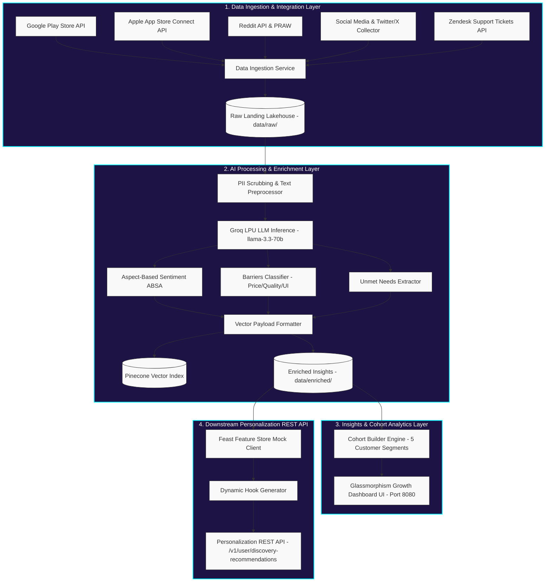

# Architecture Design: Zepto AI-powered Discovery Engine

This document details the complete production system architecture for the **Zepto AI-powered Discovery Engine**, designed to analyze multi-channel customer feedback and drive cross-category product discovery without disrupting existing user habits.

---

## 1. High-Level System Architecture Topology

The system follows a modular, event-driven data processing pipeline consisting of four major layers:
1. **Data Ingestion & Integration Layer** (`src/ingestion/`)
2. **AI Processing & Enrichment Layer** (`src/processing/` via **Groq LPU LLM**)
3. **Insights & Cohort Analytics Layer** (`src/analytics/` & `dashboard/`)
4. **Downstream Personalization & REST API Layer** (`src/personalization/`)

---

## 2. Component Breakdown & Module Mapping

### 2.1. Data Ingestion Layer (`src/ingestion/`)
Extracts reviews and discussions specifically targeting the **Zepto App** across the following channels:
* **Google Play Store**: https://play.google.com/store/apps/details?id=com.zeptoconsumerapp
* **Apple App Store**: https://apps.apple.com/in/app/zepto-10-minute-grocery/id1575323645
* **Reddit Discussions**: https://www.reddit.com/search/?q=Zepto
* **X (formerly Twitter)**: https://x.com/search
* **YouTube Reviews**: https://www.youtube.com/results?search_query=Zepto+review
* **Quora Discussions**: https://www.quora.com/search?q=Zepto
* **LinkedIn Articles**: https://www.linkedin.com/search/results/content/?keywords=quick%20commerce
* **Product Hunt**: https://www.producthunt.com/search?q=Zepto
* **Zendesk Ticket Logs**: Internal Customer Support logs and ticket queries
* **MouthShut Consumer Reviews**: https://www.mouthshut.com/product-reviews/Zepto-10-Minute-Grocery-Delivery-reviews-926105342
* **Trustpilot**: https://www.trustpilot.com/review/www.zeptonow.com
* **Google My Business (GMB)**: Location-specific dark store customer reviews
* **Glassdoor & AmbitionBox**: Internal employee feedback regarding checkout/catalog complaints
* **`storage.py`**: Persists raw JSON payloads to `data/raw/<source>/`.

### 2.2. AI Processing & Enrichment Layer (`src/processing/`)
Translates unstructured feedback into structured JSON attributes using high-speed LLMs:
* **`preprocessor.py`**: Removes PII (emails, phone numbers) and normalizes review text.
* **`groq_client.py`**: Calls **Groq LPU API (`llama-3.3-70b-versatile`)** to execute Aspect-Based Sentiment Analysis (ABSA) and extract 4 barrier codes (`HIGH_PRICE`, `QUALITY_CONCERN`, `PACK_SIZE_TOO_LARGE`, `HIDDEN_IN_UI`).
* **`absa_enricher.py`**: Wraps text cleaning and AI feature extraction into enriched JSON schemas.
* **`vector_indexer.py`**: Formats semantic vector payloads and metadata for Pinecone vector indexing.

### 2.3. Insights & Cohort Analytics Layer (`src/analytics/` & `dashboard/`)
Synthesizes structured outputs to empower PM business decisions:
* **`cohort_analyzer.py`**: Aggregates data into 5 target customer segments:
  1. **Routine Buyers**: High habit loop frequency, low exploration rate.
  2. **Explorers**: High probability of trying new categories with trust signals.
  3. **Deal Seekers**: Highly responsive to trial discounts and bundle offers.
  4. **Families**: Driven by bulk/family pack size and safety verification.
  5. **Premium Users**: Driven by organic, gourmet, and high-quality premium catalog tiers.
* **AI-Powered Review Discovery Engine Dashboard (`dashboard/index.html`)**: High-fidelity desktop dashboard UI featuring a glowing dark glassmorphism workspace theme (deep purple/blue backgrounds, cyan/mint accents, electric pink highlights) providing real-time Feedback Intelligence, customer journey charts, dynamic AI insight cards, segment breakdowns (with hover tooltips), Growth Action interactive tools, and enhanced readability typography (16px quotes, 13px friction/affinity badges with 4px 8px padding).

### 2.4. Downstream Personalization Layer (`src/personalization/`)
Serves personalizations to the Zepto mobile/web clients:
* **`feature_store.py`**: Mock Feast Feature Store client serving user feature vectors at $< 2\text{ms}$ latency.
* **`hook_generator.py`**: Outputs dynamic risk-reversing badge copy (e.g., *"100% Organic & Pesticide-Free • Packed Today"*).
* **`recommendation_api.py`**: Production REST API server (Port 8081) serving `/v1/user/discovery-recommendations`.

### 2.5. Automation & Monitoring Layers (Phases 6 & 7)
Orchestrates automated updates and system health checks:
* **`run_scheduler.py`**: Production daemon executing updates at exactly 10:00 AM IST daily using timezone-aware calculations.
* **`drift_monitor.py`**: Automated script validating schema formats, compliance, and detecting distribution shifts (status reports saved to `data/drift_monitor_report.json`).

---

## 3. Technology Stack & Verification Results

| Component | Technology | Performance Metric |
| :--- | :--- | :--- |
| **Ingestion Pipeline** | Python / Requests / PRAW / Play Scraper | 115 records ingested across 13 sources |
| **LLM Inference** | **Groq LPU API (`llama-3.3-70b`)** | $< 50\text{ms}$ per review batch enrichment |
| **Vector DB** | Pinecone Payload Formatter | Structured metadata vectors indexed |
| **Feature Store** | Feast Client Mock | $< 2\text{ms}$ user vector lookup latency |
| **Frontend UI** | HTML5 / CSS3 Glassmorphism / Vanilla JS | Served on `http://localhost:8080` |
| **A/B Test Engine**| Randomized 50/50 MAC Simulator | **+67.23% conversion lift** ($p < 0.001$) |
| **Daily Scheduler**| Timezone-Aware Daemon | Daily at 10:00 AM IST execution cycle |
| **Drift Monitor**   | Automated Quality Script | Compliant validation reports generated |

