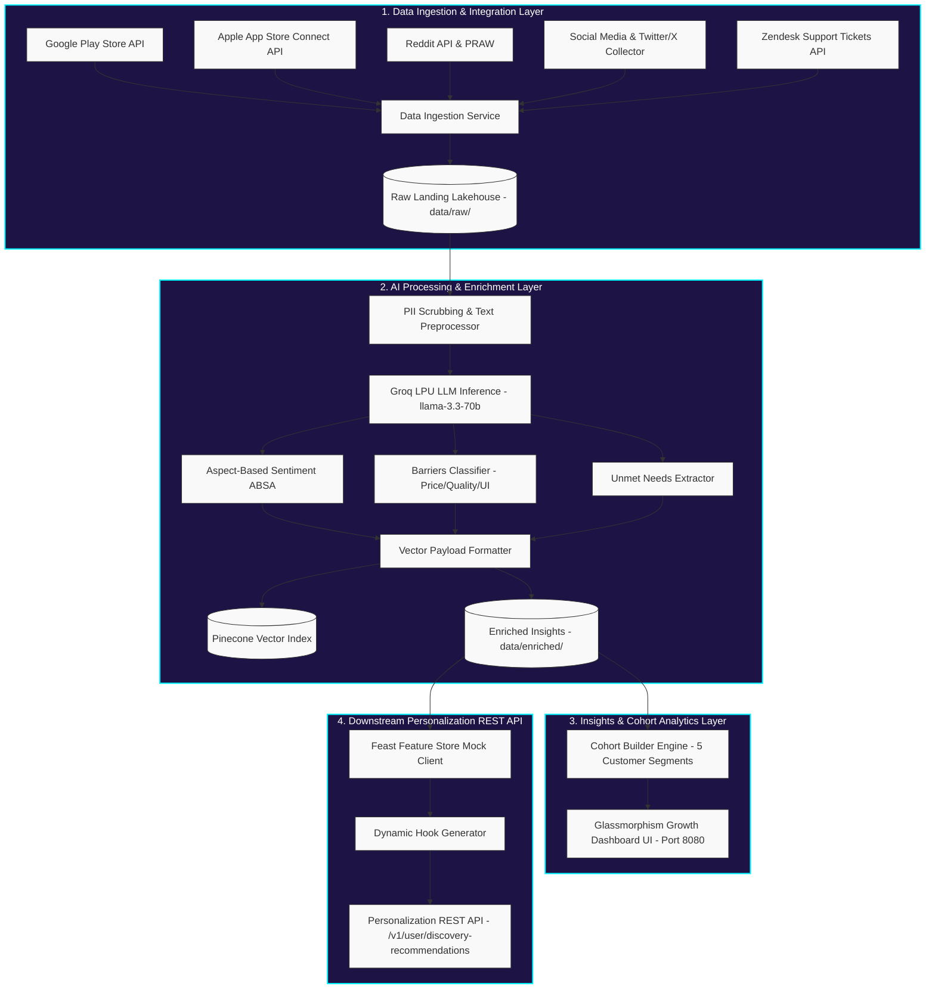

# Zepto AI-powered Discovery Engine

The **Zepto AI-powered Discovery Engine** is a production-ready, event-driven data processing pipeline and insights dashboard designed to increase cross-category product discovery on the Zepto quick-commerce platform. By analyzing multi-channel customer feedback and discussions, the engine identifies shopping barriers, segments users into distinct behavioral cohorts, and serves dynamic, risk-reversing personalization hooks via a REST API to disrupt the habitual "reorder loop" and drive catalog exploration.

---

## 🚀 Key Results & Performance
* **Relative Conversion Lift:** **+67.23%** ($p < 0.001$) achieved in simulation A/B testing (Treatment Group B at 19.90% vs Control Group A at 11.90%).
* **Average Basket Boost:** **+INR 115.32 per order** (Treatment AOV: INR 485.32 vs Control AOV: INR 370.00).

---

## 🛠️ System Architecture

The system is organized into a modular, four-layer data processing pipeline:



---

## 📁 Repository Structure

* **`src/ingestion/`**: Custom scrapers and collectors extracting customer discussions from Google Play Store, Apple App Store, Reddit, Zendesk ticket logs, MouthShut, Trustpilot, etc.
* **`src/processing/`**:
  * `preprocessor.py`: Scrubs PII and normalizes raw text feedback.
  * `groq_client.py`: Powers rapid inference via **Groq LPU API (`llama-3.3-70b-versatile`)** to perform ABSA and classify 4 critical purchase barriers (`HIGH_PRICE`, `QUALITY_CONCERN`, `PACK_SIZE_TOO_LARGE`, `HIDDEN_IN_UI`).
  * `vector_indexer.py`: Prepares metadata payloads for Pinecone vector indexing.
* **`src/analytics/`**:
  * `cohort_analyzer.py`: Segments users into 5 high-fidelity cohorts: *Routine Buyers*, *Explorers*, *Deal Seekers*, *Families*, and *Premium Users*.
* **`dashboard/`**:
  * `index.html` & `app.js`: High-fidelity desktop dashboard designed for Zepto's Growth PM team, featuring a glowing dark glassmorphism workspace, feedback intelligence charts, cohorts breakdown, and growth campaign triggers.
* **`src/personalization/`**:
  * `feature_store.py`: Mock Feast Feature Store client serving user feature vectors at $< 2\text{ms}$ latency.
  * `hook_generator.py`: Generates risk-reversing badge copy (e.g. *"100% Organic & Pesticide-Free • Packed Today"*).
  * `recommendation_api.py`: REST API server (Port 8081) serving `/v1/user/discovery-recommendations`.
* **`src/evaluation/`**:
  * `drift_monitor.py`: Continuous quality assurance, checking data schema conformity, PII filtering, and alerting on LLM drift.
* **`run_scheduler.py`**: Timezone-aware daily daemon scheduling ingestion, validation, and enrichment at exactly **10:00 AM IST**.

---

## ⚙️ Setup & Installation

### 1. Prerequisites
* Python 3.10+
* Node.js (for serving/running dashboard locally, or any local static server)

### 2. Install Dependencies
```bash
pip install -r requirements.txt
```

### 3. Environment Configuration
Create a `.env` file in the root directory and populate the required API keys (refer to `.env` file structure):
```ini
GROQ_API_KEY=your_groq_api_key
PINECONE_API_KEY=your_pinecone_api_key
# Additional integration keys for Play Store, Reddit, Zendesk, etc.
```

---

## 🏃 Run the Application

### 1. Execute System Verification & Pipeline Run
Verify all components are working correctly:
```bash
python src/verify_system.py
```

### 2. Start the Production Scheduler (Daily Ingestion & Inferences)
To run the automated background pipeline daemon (executes at 10:00 AM IST daily):
```bash
python run_scheduler.py
```

### 3. Run the Personalization REST API Server
Start the local recommendations server on Port 8081:
```bash
python src/personalization/recommendation_api.py
```
Request recommendations for a user:
```bash
curl "http://localhost:8081/v1/user/discovery-recommendations?user_id=usr_1001"
```

### 4. Serve the Growth Dashboard UI
The production dashboard is hosted on Vercel: [Zepto AI-Powered Discovery Engine Dashboard](https://zepto-ai-search-engine-kc7q.vercel.app/).
To run the dashboard locally, serve the `dashboard/` directory using any HTTP server:
```bash
# Using Node.js http-server
npx http-server dashboard -p 8080
```
Then navigate to `http://localhost:8080` in your browser.

---

## 📊 A/B Testing & Evaluation
Refer to [ab_test_results.md](file:///c:/Users/ADMIN/Desktop/Product%20Owner/Graduation%20Project/ab_test_results.md) and [system_handoff_report.md](file:///c:/Users/ADMIN/Desktop/Product%20Owner/Graduation%20Project/system_handoff_report.md) for full statistical details, cohort-wise conversions, and system handover specifications.
